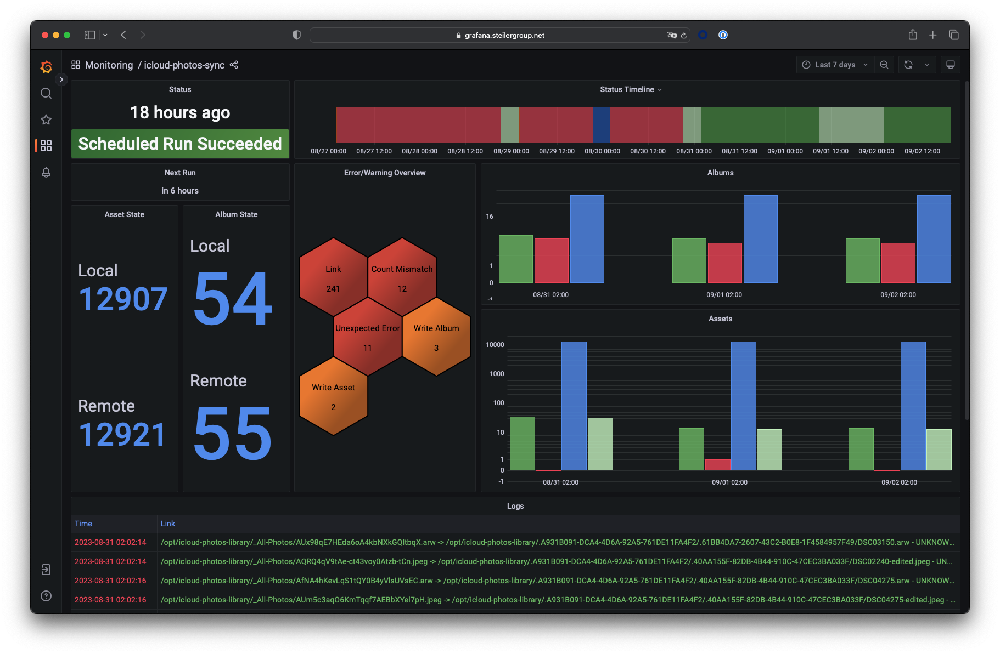

# Sync Metrics Export

This application can export various sync related metrics, which can be used to monitor the sync activities and status. Those metrics are exported to a file, formatted using the [Influx Line Protocol](https://docs.influxdata.com/influxdb/v2.6/reference/syntax/line-protocol/). 

## Usage

Set the [export metrics flag](../cli/#export-metrics), in order to activate the exporter. The file will be written to the root of the data directory and is named `.icloud-photos-sync.metrics`. This file can be consumed using [telegraf's](https://www.influxdata.com/time-series-platform/telegraf/) [tail input plugin](https://github.com/influxdata/telegraf/blob/release-1.25/plugins/inputs/tail/README.md). The following is a sample configuration:

```
[[inputs.tail]]                                                                 
  files = ["/opt/icloud-photos-library/.icloud-photos-sync.metrics"]
  data_format = "influx"
```

## Grafana Dashboard

After importing the metrics into an InfluxDB through telegraf, you can use Grafana to visualize the data. The following example is [available for download](https://github.com/steilerDev/icloud-photos-sync/tree/main/docs/grafana):

[](../assets/grafana-dashboard.png)

When importing the JSON model you need to provide an InfluxDB datasource that supports InfluxQL. [InfluxDB 1.X supports this out of the box](https://docs.influxdata.com/influxdb/v1/query_language/), [InfluxDB 2.X needs to be configured to support InfluxQL](https://docs.influxdata.com/influxdb/v2/query-data/influxql/). 

Additionally you need to specify the measurement name, where the sync metrics are stored. For InfluxDB 1.X this should always be `icloud_photos_sync` (as this is specified in the Influx Line Protocol written by this tool), InfluxDB 2.X however needs to include the [database and retention policy mapping](https://docs.influxdata.com/influxdb/v2/query-data/influxql/#query-a-mapped-bucket-with-influxql) in the measurement query. This could be something like `example-db.example-rp.icloud_photos_sync`, but depends [on the DBRP mapping you previously created](https://docs.influxdata.com/influxdb/v2/query-data/influxql/dbrp/#create-dbrp-mappings).

## Metrics

All metrics are created using the measurement name `icloud_photos_sync`. 

The following fields will be written:

  - `status`: Provides a string of the current sync progress status. This can include:
    - `AUTHENTICATION_STARTED`
    - `AUTHENTICATED`
    - `MFA_REQUIRED`
    - `MFA_RECEIVED`
    - `MFA_NOT_PROVIDED` (if the MFA code was not provided before timeout)
    - `DEVICE_TRUSTED`
    - `SESSION_EXPIRED` (if the current session expired and needs to be refreshed)
    - `ACCOUNT_READY`
    - `ICLOUD_READY`
    - `SYNC_START`
    - `FETCH_N_LOAD_STARTED`
    - `FETCH_N_LOAD_COMPLETED`
    - `DIFF_STARTED`
    - `DIFF_COMPLETED`
    - `WRITE_STARTED`
    - `WRITE_ASSETS_STARTED`
    - `WRITE_ASSETS_COMPLETED`
    - `WRITE_ALBUMS_STARTED`
    - `WRITE_ALBUMS_COMPLETED`
    - `WRITE_COMPLETED`
    - `SYNC_COMPLETED`
    - `SYNC_RETRY`
    - `ERROR`
    - `SCHEDULED` (no previous run)
    - `SCHEDULED_SUCCESS` (last run successful)
    - `SCHEDULED_FAILURE` (error during last run)
  - `status_time`: Provides the time, when the status was last updated
  - Local and remote library state:
    - `local_assets_loaded`: Gives the amount of local assets loaded during a sync
    - `local_albums_loaded`: Gives the amount of local albums loaded during a sync
    - `remote_assets_fetched`: Gives the amount of remote assets loaded during a sync
    - `remote_albums_fetched`: Gives the amount of remote albums loaded during a sync
  - Sync metrics:
    - `assets_to_be_added`: Gives the amount of assets that are meant to be added after diffing the local and remote state
    - `assets_to_be_kept`: Gives the amount of assets that are meant to be kept after diffing the local and remote state
    - `assets_to_be_deleted`: Gives the amount of assets that are meant to be deleted after diffing the local and remote state
    - `asset_written`: The record name of each asset written to disk
    - `albums_to_be_added`: Gives the amount of albums that are meant to be added after diffing the local and remote state
    - `albums_to_be_kept`: Gives the amount of albums that are meant to be kept after diffing the local and remote state
    - `albums_to_be_deleted`: Gives the amount of albums that are meant to be deleted after diffing the local and remote state
  - Daemon metrics:
    - `next_schedule`: Gives the time of the next scheduled execution
  - Archive metrics:
    - `assets_archived`: Gives the amount of assets archived during an archive operation
    - `remote_assets_deleted`: Gives the amount of remote assets deleted during an archive operation
  - `errors`: Gives an error message for each recorded error
  - Warnings (see [common warnings for context](../common-warnings/)), gives an error message for each recorded warning
    - `warn-count_mismatch`
    - `warn-library_load_error`
    - `warn-extraneous_file`
    - `warn-icloud_load_error`
    - `warn-write_asset_error`
    - `warn-write_album_error`
    - `warn-link_error`
    - `warn-filetype_error`
    - `warn-mfa_resend_error`
    - `warn-resource_file_error`
    - `warn-archive_asset_error`